# Pratikum 8  - PHP dan Database MySQL
### NAMA : Raihan Ardiansyah
### NIM : 312410396
### KELAS : TI.24.A3

## 📍LANGKAH - LANGKAH PENGERJAAN

### 1. Persiapan 

Untuk memulai membuat aplikasi CRUD sederhana, yang perlu disiapkan adalah
database server menggunakan MySQL. Pastikan MySQL Server sudah dapat dijalankan
melalui XAMPP.

**Menjalankan MySQL Server**

Untuk menjalankan MySQL Server dari menu XAMPP Contol.

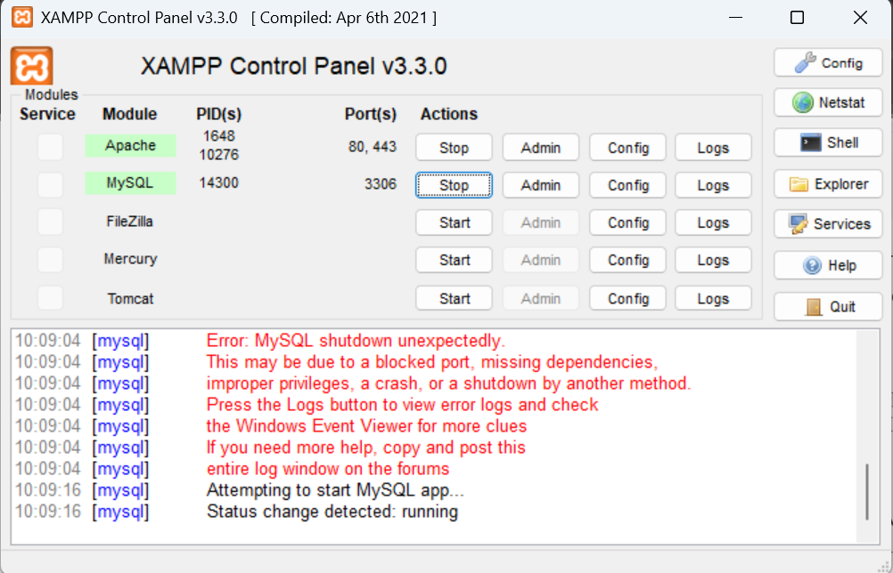

**Mengakses MySQL Client menggunakan PHP MyAdmin**

Pastikan webserver Apache dan MySQL server sudah dijalankan. Kemudian buka
melalui browser: http://localhost/phpmyadmin/

**Membuat Database: Studi Kasus Data Barang**

**Membuat Database**

CREATE DATABASE latihan1;

**Membuat Tabel**

CREATE TABLE data_barang (

id_barang int(10) auto_increment Primary Key,

kategori varchar(30),

nama varchar(30),

gambar varchar(100),

harga_beli decimal(10,0),

harga_jual decimal(10,0),

stok int(4)

);

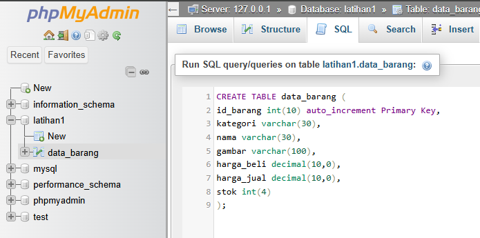

**Menambahkan Data**

INSERT INTO data_barang (kategori, nama, gambar, harga_beli, harga_jual, stok)

VALUES ('Elektronik', 'HP Samsung Android', 'hp_samsung.jpg', 2000000, 2400000, 5),

('Elektronik', 'HP Xiaomi Android', 'hp_xiaomi.jpg', 1000000, 1400000, 5),

('Elektronik', 'HP OPPO Android', 'hp_oppo.jpg', 1800000, 2300000, 5);

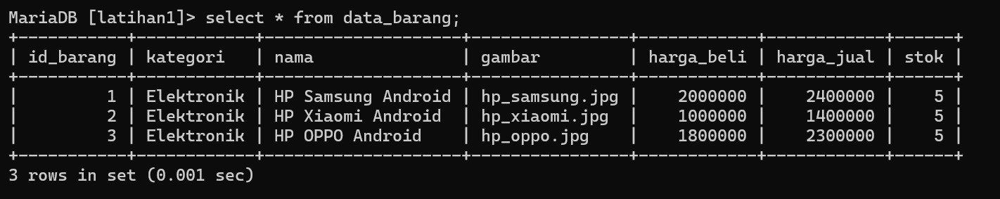

**Membuat Program CRUD**

Buat folder lab8_php_database pada root directory web server (d:\xampp\htdocs)

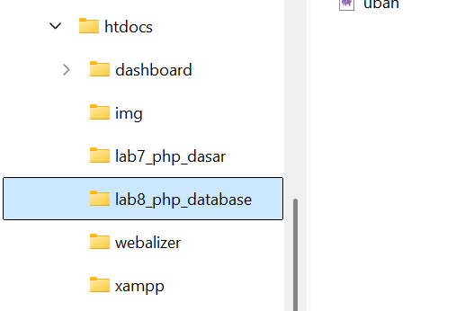

Kemudian untuk mengakses direktory tersebut pada web server dengan mengakses URL:
http://localhost/lab8_php_database/

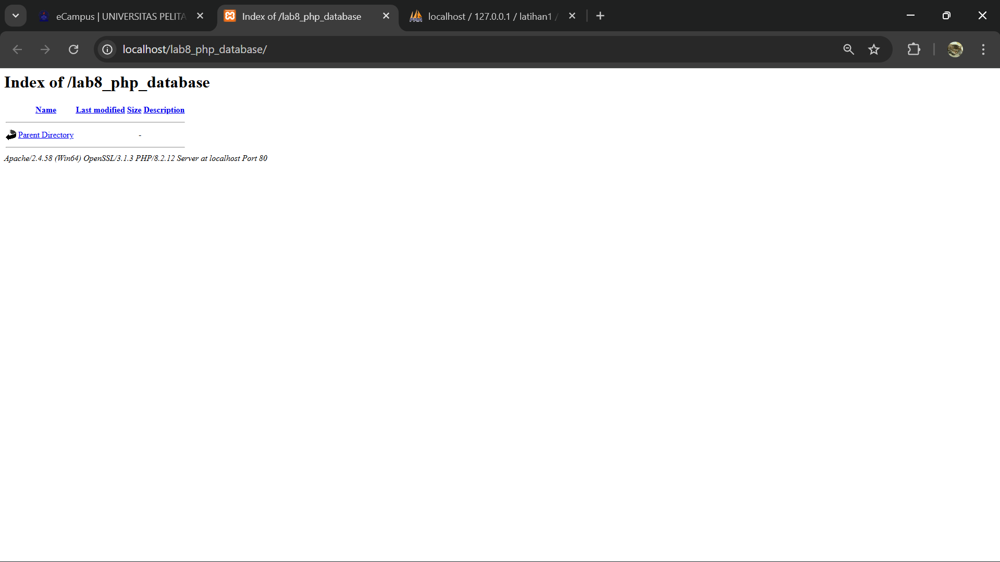

**Membuat file koneksi database**

Buat file baru dengan nama koneksi.php

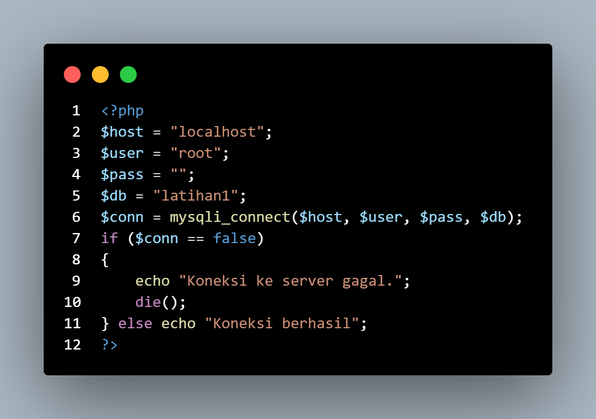

Buka melalui browser untuk menguji koneksi database (untuk menyampilkan pesan
koneksi berhasil, uncomment pada perintah echo “koneksi berhasil”;

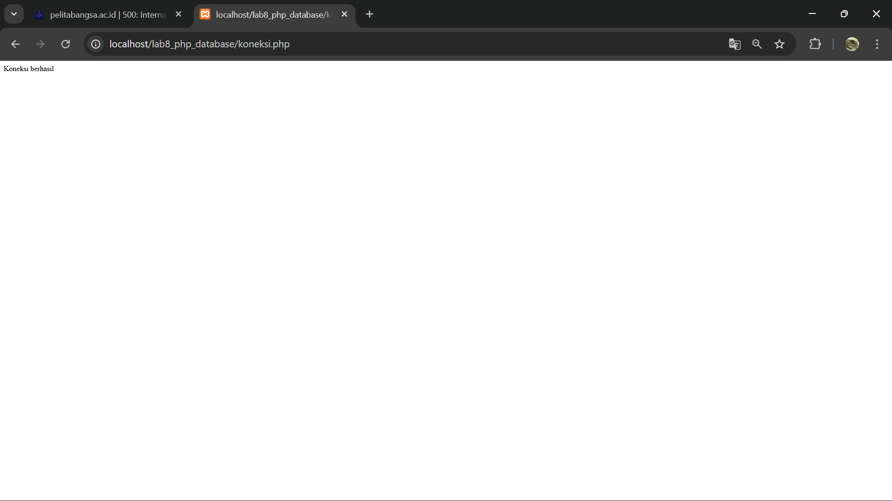

**Membuat file index untuk menampilkan data (Read)**

Buat file baru dengan nama index.php

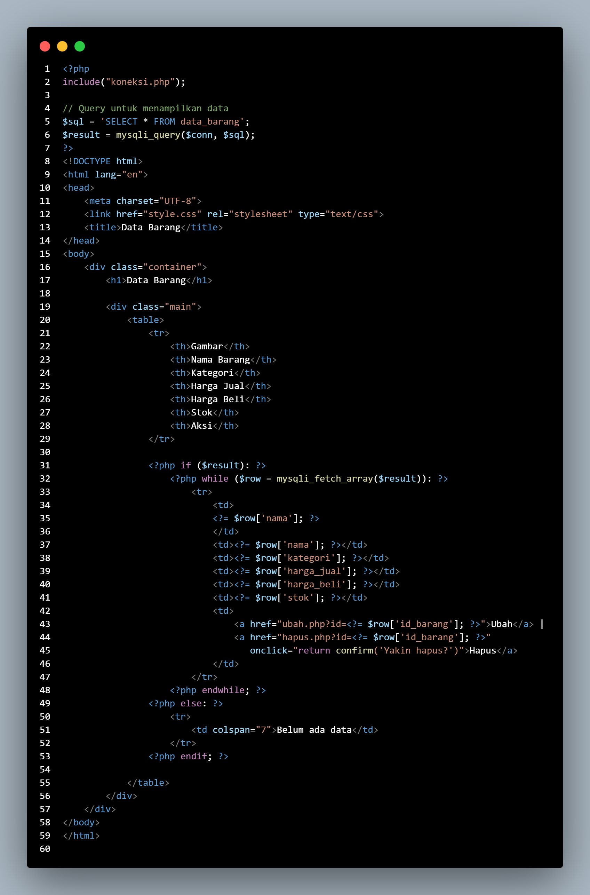

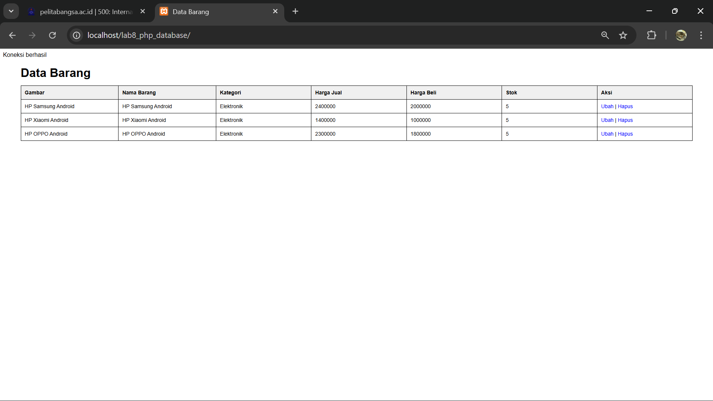

**Menambah Data (Create)**

Buat file baru dengan nama tambah.php

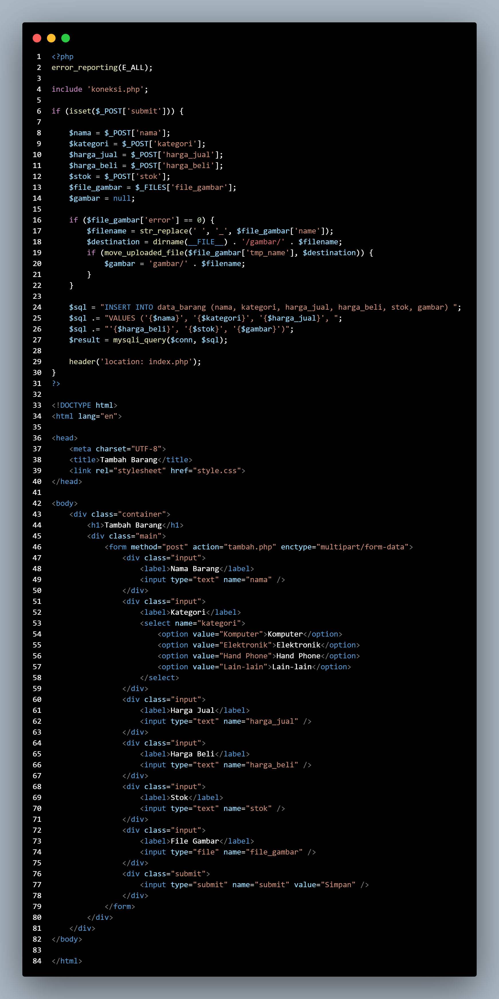

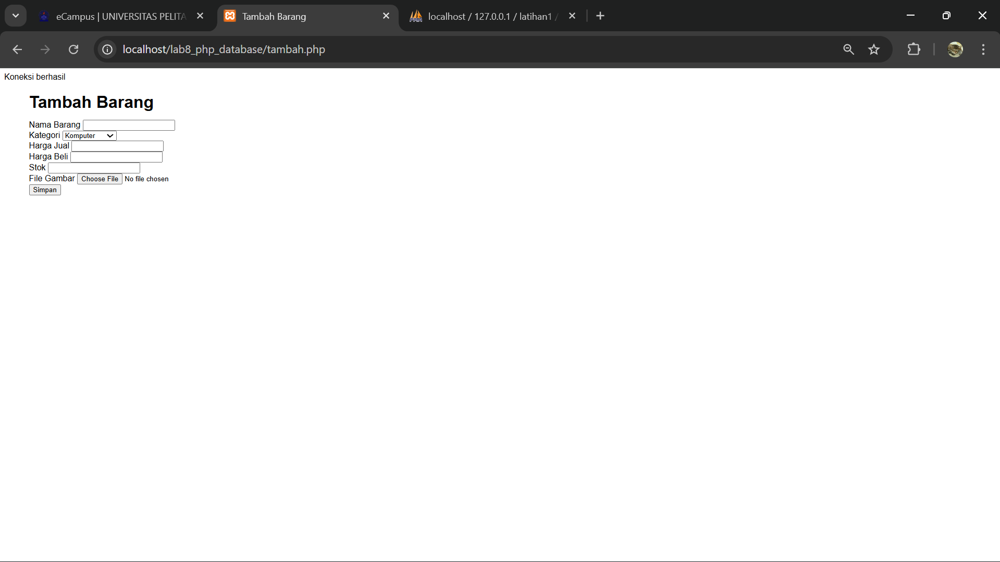

**Mengubah Data (Update)**

Buat file baru dengan nama ubah.php

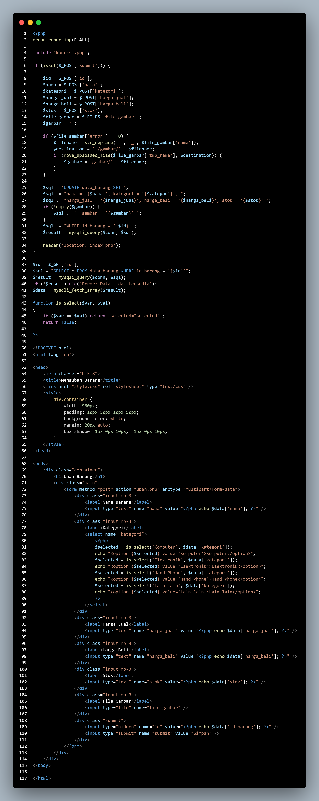

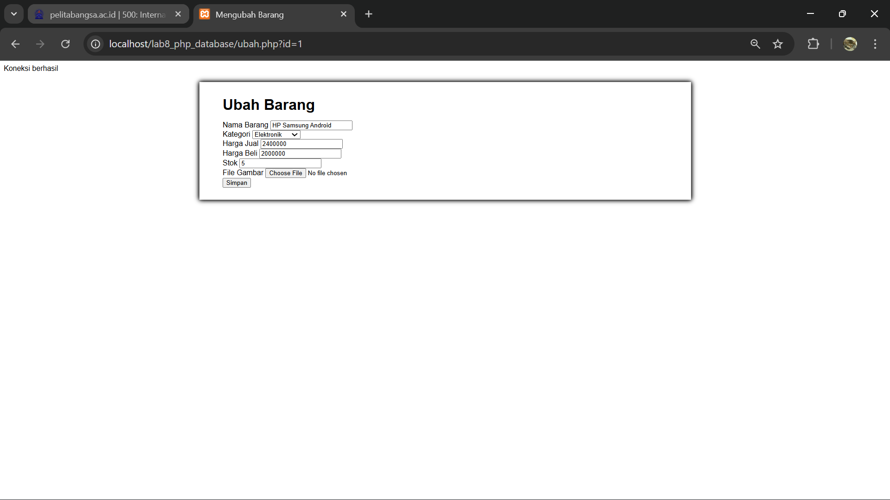

**Menghapus Data (Delete)**

Buat file baru dengan nama hapus.php

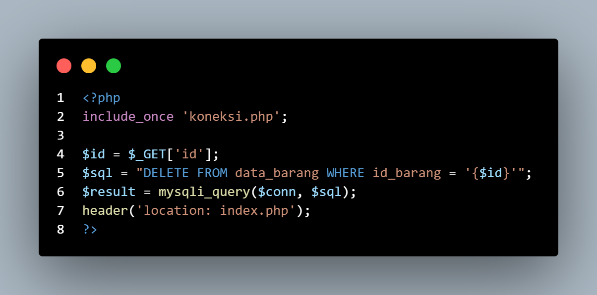
